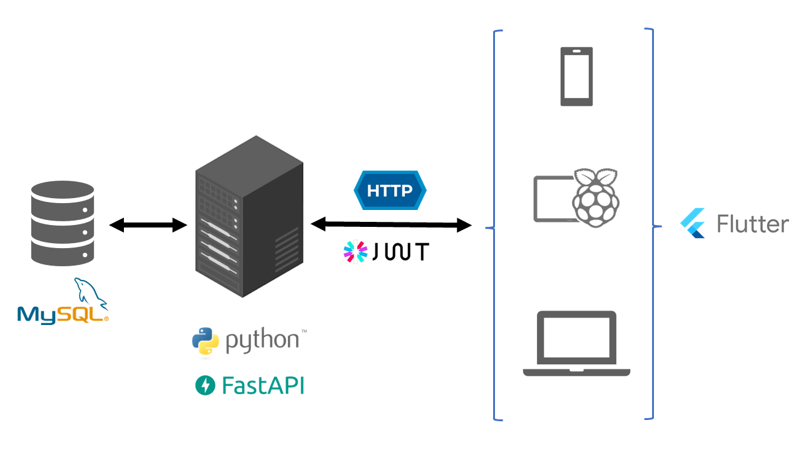

# polito-comm-systems-project

## About

This is a generic inventory management app built for the "Projects & Laboratory on Communication Systems" course @ Politecnico di Torino, Spring 2022. 

Created by: [Daniel Smith](https://github.com/dansmith5764), [Catarina Mouro](https://github.com/CatarinaMouro) & [Lino Mediavilla](https://github.com/linomp).

See '[Project Description](./project_description.pdf)' for more details.

### Features
- Extensible Item schema
- Username/Password login
- RFID card login
- Identification of warehouse items with RFID tags
- Web, Mobile & 'Totem' client (Raspberry pi + Touchscreen on kiosk mode)
- Admin GUI
- Multi-tenant

### Stack
- **Frontend**: Flutter (Web & Mobile targets)
- **Backend**: MySQL, FastAPI, Mosquitto MQTT Broker
- **Deployment**: Digital Ocean, Docker
- **Hardware**: Raspberry Pi, LCD Touchscreen, RFID tags + reader

    

## Repository contents
- [Frontend](./inventory-client/README.md)
- [Backend](./inventory-backend/README.md) 
- [DB script](./db/)
